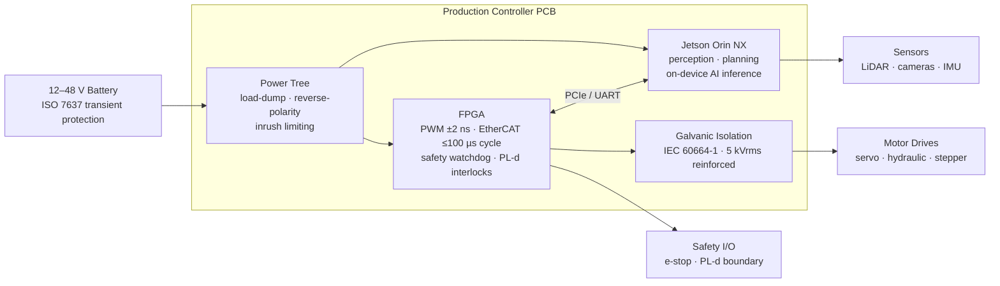

## The lab-to-field gap nobody documents

Most field-robotics control stacks begin on a Jetson developer kit wired to a motor driver over USB. That gets a team moving quickly — fast iteration, good SDK support, easy access to perception libraries. Then the first field pilot happens.

Day one on a job site: a connector vibrates loose. Day three: a load-dump event — the battery briefly disconnects at high current during an engine start — produces a voltage transient that reboots the control board mid-cycle. Day five: an e-stop is triggered but the actuator keeps moving for 200 ms because the safety interlock checked a software flag on the Jetson, which had entered an OOM kill cycle and stopped responding.

This failure sequence is not unusual. It is what happens when teams skip the step between "prototype with developer kits" and "deploy in a real machine." NVIDIA states it plainly: Jetson developer kits are not for production use. They carry a 1-year development-only warranty and no product lifecycle guarantee. The production-grade Jetson module inside a developer kit is the right silicon. The carrier board around it is not field hardware.

The jump from developer kit to production field controller is not a firmware revision. It is a hardware category change — one that requires rethinking the power tree, the isolation architecture, the connector spec, and the safety boundary from the ground up.

---

## Three machines, six constraints

Three machine types define the range of conditions a field controller must survive.

An **agricultural sprayer** running 12-hour shifts in [agricultural robotics](/use-cases#agriculture): continuous engine vibration, spray water and dust reaching the electronics enclosure, and thermal cycling from −20 °C pre-dawn cold starts to +45 °C afternoon cab temperatures under a Kansas summer sun.

An **autonomous excavator** in a surface mine — representative of [construction and mining](/use-cases#construction): diesel PTO vibration at 10–55 Hz continuous, dust concentrations that saturate enclosure filters in hours, and a 24 V DC bus that sees load-dump transients every time the charging system disconnects under load.

A **marine inspection ROV** operating in [marine and underwater](/use-cases#marine) conditions: saltwater spray and potential partial immersion, near-100% relative humidity, and connector corrosion on anything not hermetically sealed.

Each machine is different. The following six constraints apply to all of them.

---

## The six non-negotiables

| Constraint | Standard | Minimum spec | What fails if skipped |
|---|---|---|---|
| Ingress protection | IEC 60529 | IP67 | Dust ingestion, condensation damage |
| Operating temperature | Industrial silicon grade | −40 °C to +85 °C | Component thermal shutdown, latent damage |
| Vibration and shock | IEC 60068-2-64 / -27 | Land-vehicle random vibration profile | Solder joint cracking, connector ejection |
| EMC immunity | IEC 61800-3 / IEC 61000-4 | Category C2 minimum | Logic corruption from motor inverter switching |
| Power transients | ISO 7637 | 12–48 V DC, load-dump protected | Regulator destruction on battery disconnect |
| Safety partitioning | ISO 13849-1 | PL-d (Category 3) | Unsafe actuator state on CPU fault |

### Ingress protection (IEC 60529)

IP65 means complete dust exclusion and protection from low-pressure water jets. IP67 adds temporary immersion to 1 m depth. IP67 is the production minimum for outdoor field electronics — confirmed by agricultural robotics protection design guidelines and ISO 16750-3, which covers mechanical and environmental conditions for electrical equipment on road and off-road vehicles. Boards with open-frame PCBs and standard 0.1-inch headers fail this test before vibration testing begins.

### Wide-temperature operation

The industrial-grade silicon standard is −40 °C to +85 °C. That matches the Lattice ECP5 industrial-grade FPGA (with an automotive variant extending to +125 °C) and purpose-built field carriers like the Connect Tech Boson, which is rated −40 °C to +85 °C on a +9–36 V input. A sealed aluminium enclosure under direct summer sun pushes internal temperature well above ambient — components rated to +70 °C commercial grade exhaust the thermal budget before the enclosure is bolted shut.

### Vibration and shock (IEC 60068-2)

IEC 60068-2-64 defines broadband random vibration profiles for land-vehicle installations. IEC 60068-2-27 covers mechanical shock and bump. IEC 60068-2-6 covers sinusoidal vibration. These tests find failure modes that bench testing misses: through-hole components that crack solder joints under sustained 15 Hz vibration, edge connectors that back out under shock loading, heat sinks that separate from packages during thermal cycling (IEC 60068-2-14). PCB stackup design, copper weight, and mechanical mounting strategy matter here as much as component selection.

### EMC immunity around traction motors (IEC 61800-3 / IEC 61000-4)

A traction motor inverter switching at 10–20 kHz generates conducted and radiated interference across the bands that IEC 61800-3 and IEC 61000-4 test for immunity. Without galvanic isolation between the digital control domain and the motor/power domain, switching edges from the inverter couple into logic supply rails and corrupt control signals — producing failures that look exactly like random firmware crashes.

IEC 60664-1 mandates 4–8 mm creepage distances across isolation barriers depending on working voltage and pollution degree. The production answer is reinforced digital isolators rated to 5 kVrms with high common-mode transient immunity (CMTI) — selected specifically for the dV/dt of inverter switching edges, not just for static high-voltage separation.

---

## The control-spine architecture

The architecture splits into two domains separated by a hardware boundary.

The [FPGA real-time control](/platform#capabilities) layer closes the deterministic loops: PWM generation at ±2 ns accuracy with zero dependence on CPU load or interrupt latency, EtherCAT fieldbus at ≤100 µs cycle times with ≤1 µs distributed clock jitter between slave nodes, hardware watchdogs, and the safety interlock logic. For comparison, PREEMPT_RT Linux achieves approximately 60 µs timing jitter under load — an order of magnitude worse than a hard field-robotics requirement. Standard ROS2 on Ubuntu cannot guarantee a 1 ms control cycle with jitter below 200 µs. An FPGA has no OS, no scheduler, and no interrupt contention.

The Jetson Orin handles perception, planning, and on-device AI inference — everything that benefits from a GPU and a high-level software stack. Your algorithm is the brain. The controller is the spine.

### Safety partitioning (ISO 13849-1)

ISO 13849-1 PL-d requires a PFHd between 1×10⁻⁷ and 1×10⁻⁸ dangerous failures per hour, achieved through Category 3 architecture — redundant channels with diagnostic coverage. PL-e (the highest level) requires Category 4. Both levels explicitly prohibit relying on single-channel software running on a non-deterministic OS for safety-relevant functions.

The watchdog pattern for a field controller is straightforward: if the Jetson's Linux side hangs — OOM event, thermal throttle, scheduler contention — a hardware counter on the FPGA times out and drops all power stage outputs to a defined safe state within the watchdog period. The safety boundary is a hardware signal, not a function call.

### Power tree (ISO 7637 / IEC 61000-4)

Production field controllers run from 12–48 V DC battery input — the range covered by ISO 7637 transient tests for 12 V, 24 V, and 48 V vehicle electrical systems. A production power tree requires: load-dump protection (battery disconnection under active charge produces voltage spikes that destroy unprotected linear regulators), reverse-polarity protection, and inrush current limiting to IEC 61000-4 class targets. These are not optional features on a field controller; they are the difference between a board that survives its first cold start and one that does not.

---

## Lifecycle and supply chain

A machine shipping in 2027 may still be in the field in 2037. Component longevity is a first-class design constraint, not an afterthought.

**Jetson Orin production modules** — AGX Orin, Orin NX, and Orin Nano families — carry production availability through January 2032. AGX Orin Industrial extends to July 2033. Teams still running LPDDR4-based modules (TX2 NX, TX2i, Xavier NX 8/16 GB, AGX Xavier 32 GB Industrial) face an accelerated last-ship date of **July 15, 2027** due to DRAM supply constraints announced in April–May 2026. If your current design uses any of those modules, migration to the Orin family is not optional — it is urgent.

**FPGA families**: AMD Artix-7 and Spartan-7 (7-series) lifecycle commitments extend through at least 2040, with AMD's long-lifecycle program announcing support paths through 2045 and beyond. Lattice ECP5 industrial-grade (−40 °C to +100 °C) is actively specified for new field controller designs and available through standard distribution channels. Connector and passive component families need the same scrutiny — a 5-year minimum component roadmap is the floor for any OEM program with multi-year production runs.

---

## Vendor evaluation checklist

These five questions separate serious controller vendors from PCB contract shops that added "robotics" to their homepage:

| Question | Why it matters |
|---|---|
| Who owns the schematic and design files? | You need them for independent manufacturing, certification audit, and long-term serviceability |
| Who controls firmware updates — do you get source? | OTA capability and source access determine your 10-year serviceability posture |
| What is the NRE structure? | $0-NRE models exist (customer pays only for production hardware); understand exactly what you pay for before signing |
| What is the realistic prototype lead time? | 3–5 months is standard for a customized field controller; shorter timelines typically mean off-the-shelf compromises on I/O mapping or power tree |
| What certification documentation does the vendor provide? | CE, FCC, IEC 61508 / ISO 13849 audit trail — at minimum, the documentation that supports your own certification path to market |

---

## What TACTUN does

TACTUN's founding team has shipped 800+ controllers across industrial machines. We define a board architecture — schematic, I/O selection, power tree, FPGA pin plan — in 5 business days from a complete system requirements document; see [how we work](/platform#how-we-work). NRE is $0; you pay for production hardware. A customized field controller reaches first prototype in 3–5 months through contract manufacturing.

The platform pairs a Lattice ECP5 or AMD Artix-7 FPGA with a production Jetson Orin NX or Orin Nano module — not a developer kit. The board integrates the ISO 7637-class power tree, galvanic isolation to IEC 60664-1, and I/O matched to your specific actuators and sensors. Frank Bacon Machinery (Detroit, USA) co-developed their machine controller with TACTUN; John Stencel IV, CEO: "TACTUN became a key technology partner in our machine development." TACTUN is an NVIDIA Inception Program member.

<figure>
  
  <figcaption>TACTUN production controller board: FPGA real-time section, Jetson Orin NX integration, and isolated power domain in a single package.</figcaption>
</figure>
{/* image_brief: Annotated product photo or high-quality 3D render of a TACTUN controller PCB. Key visual elements: (1) FPGA section labelled "deterministic real-time control", (2) Jetson Orin NX module connector / mating area, (3) a visible isolation barrier or isolation IC package between the digital and power domains, (4) the input power filtering section showing TVS diodes or suppression components. Style: clean product photography on a neutral or white background with callout labels in the TACTUN brand typeface. Source: commission an annotated photo from the existing TACTUN prototype board, or request a 3D render from the board designer. Rafayel to source before merge. */}

---

Tell us what machine you're building — describe the environment, actuator types, and safety requirements, and we'll map out a controller architecture in 5 business days. [Start a conversation →](/contact)
