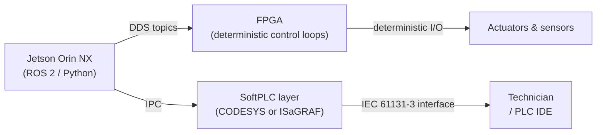

Your machine runs a Jetson Orin NX for perception, a C++ ROS 2 stack for coordination, and an FPGA closing real-time control loops. IEC 61131-3 is the last thing on your mind. Then an industrial buyer sends a procurement checklist. Line 17: *"IEC 61131-3 compliance required."* You've spent two years building an AI-native control spine and now you're wondering whether you need to rewrite it in Ladder Diagram.

You don't. But you need to understand what the standard actually requires — and when a SoftPLC compatibility layer gives you the checkbox without touching your control architecture.

## What IEC 61131-3 is

IEC 61131-3 is the international standard titled *Programmable controllers – Part 3: Programming languages*, published by the International Electrotechnical Commission. First issued in December 1993, it reached Edition 4 in May 2025. The standard specifies the syntax and semantics of programming languages for programmable logic controllers — the deterministic hardware controllers that have run factory automation, process control, and packaging machinery for decades.

Edition 4 defines four active languages:

| Language | Abbr | Style | Typical use |
|---|---|---|---|
| Structured Text | ST | Text (Pascal-like) | Complex logic, math, loops — closest to conventional programming |
| Ladder Diagram | LD | Visual relay-logic symbols | Technician-readable logic; direct relay-wiring migration |
| Function Block Diagram | FBD | Interconnected visual blocks | Continuous control, PID loops |
| Sequential Function Chart | SFC | State-machine diagram | Batch processes, multi-step sequences |

A fifth language, Instruction List (IL), was deprecated in Edition 3 (2013) and removed entirely from Edition 4 (2025). Edition 4 also adds object-oriented properties with PRIVATE, PROTECTED, and PUBLIC access specifiers, Mutex and Semaphore primitives for concurrency synchronisation, and UTF-8 string types (USTRING, UCHAR) — the first substantial modernisation since Edition 3.

## Where IEC 61131-3 dominates

Every major industrial PLC platform conforms to IEC 61131-3. Beckhoff TwinCAT 3 explicitly meets the standard across all four languages on x86 PC hardware. Rockwell Automation Studio 5000 Logix Designer is IEC 61131-3 compliant across LD, ST, FBD, and SFC, with conformance documented in publication 1756-PM018. B&R Automation Studio supports all four languages plus ANSI C and C++.

The common thread is readability by people who are not software engineers. Ladder Diagram looks like the relay-wiring diagrams maintenance technicians have read for 40 years. IEC 61131-3 standardises that shared vocabulary across vendor platforms — a technician trained on one system can read control logic written on another.

## Why AI-native robotics teams bypass it

The AI-native generation writes perception in Python and C++ on Linux, connecting components through ROS 2's DDS-based publish-subscribe graph. `rclcpp` handles time-critical execution; `rclpy` handles higher-level logic. Real-time determinism comes from the FPGA layer — HDL or C running deterministic control loops independent of the Linux kernel scheduler — not from a PLC runtime.

IEC 61131-3 wasn't designed for this stack. The standard has no native concept of a DDS topic graph, GPU-accelerated inference, or over-the-air firmware updates pushed from CI. Forcing the architecture through a PLC IDE to satisfy a compliance requirement trades the engineering advantages of the modern stack for a programming model built for the 1990s factory floor.

For a detailed look at how these stacks are assembled in practice, see the [AI-native controller primer](/glossary/ai-native-controller-primer).

## When it still matters — and how to satisfy it

Two situations keep IEC 61131-3 relevant for AI-native machine builders.

**Industrial and regulated buyers.** Factory-automation customers with established Siemens, Beckhoff, or Rockwell deployments expect their maintenance team to open the machine's control logic in a PLC IDE. If your buyers are OEM integrators in that world, IEC 61131-3 will appear on procurement checklists and certification audits — plan for it from day one.

**Interoperability with existing plant systems.** A robot deployed alongside Beckhoff TwinCAT-based conveyors may need to present a programming interface the controls team can commission and modify without a software engineer in the room.

Neither situation requires rebuilding your stack. SoftPLC runtimes decouple the IEC 61131-3 programming model from the underlying hardware. CODESYS Control for Linux ARM SL runs as an IEC 61131-3-compliant SoftPLC on any ARM Linux device — the same architecture class as a platform hosting an NVIDIA Jetson module. ISaGRAF (maintained by Rockwell Automation) provides an IEC 61131-3 and IEC 61499 runtime that runs on Linux without modifying its core engine.

The SoftPLC layer satisfies the procurement requirement. The FPGA and ROS 2 architecture stay untouched.

## The decision heuristic

If your buyers are factory-automation customers accustomed to Siemens, Beckhoff, or Rockwell PLCs — plan for IEC 61131-3 compatibility from day one, even if your primary stack never touches a Structured Text editor. If your buyers are robotics OEMs and end users of autonomous machines, modern software practices typically win, and IEC 61131-3 can remain optional. In either case, the architecture decision that costs the most is ruling out a SoftPLC layer before hardware is locked — adding it later is harder than preserving the option now.

## Related standards

IEC 61131-3 appears alongside a cluster of standards on compliance checklists:

- **ISO 13849-1** — Safety of machinery: safety-related parts of control systems. Defines five Performance Levels (PLa through PLe). Applies to the hardware-and-logic combination that implements a safety function, independent of whether that logic is written in Structured Text or C.
- **IEC 61508** — Functional safety of electrical/electronic/programmable electronic (E/E/PE) systems. The parent standard from which ISO 13849-1 and IEC 62061 derive. Covers the entire functional safety lifecycle.
- **IEC 61784 / IEC 61158** — Industrial communication network profiles and fieldbus specifications. Covers EtherCAT (fieldbus type 12 in IEC 61158, CP 12 in IEC 61784-2), PROFINET, and CC-Link IE TSN. The communication layer is defined here, separately from the programming model.

The programming model (IEC 61131-3) and the safety integrity level (PLe under ISO 13849-1, SIL 3 under IEC 61508) are orthogonal. You can write a PLe-rated safety function in Structured Text or in C — the standard specifies the language, not the required safety level.

## What TACTUN does

The [TACTUN platform](/platform) is built around an FPGA spine for deterministic real-time control and NVIDIA Jetson integration for edge AI compute. The real-time layer handles servo, stepper, hydraulic, and pneumatic actuators; safety logic and machine state management are part of the platform. For customers deploying into IEC 61131-3 environments, a SoftPLC compatibility layer can run alongside this architecture — satisfying procurement requirements without redesigning the control stack.

---

Deciding whether IEC 61131-3 belongs in your architecture — and where — is easier with a clear picture of who your buyers are and what their maintenance teams look like. [Talk to us about your machine](/contact) — we've worked through this trade-off across factory-automation and autonomous-robot deployments.
