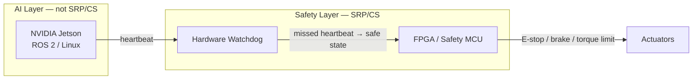

When an AI-enabled machine physically interacts with a person — an agricultural robot pausing short of a field worker, a collaborative arm limiting contact force during hand guiding — a safety failure is not a software incident. It is a regulatory event, and in some scenarios an injury. ISO 13849-1 is the standard that turns "our safety system works" into something a notified body can audit.

Most engineers encounter ISO 13849-1 when a customer asks for a CE declaration under the European Machinery Regulation (EU) 2023/1230, or when a system integrator raises conformance during acceptance testing. The standard defines **safety-related parts of control systems (SRP/CS)**: the portions of the control system that, if they fail, immediately increase risk to people near the machine. Safety functions in scope include emergency stop, interlocks, two-hand controls, and speed or position monitoring on robots and industrial equipment.

The hard problem for AI-native machines is not the math — it is the architecture. A [NVIDIA Jetson](/platform/) Orin NX running ROS 2 on Linux is a general-purpose compute platform. Standard Jetson modules carry no IEC 61508 or ISO 26262 functional safety certification. Routing the emergency-stop path or the safety-rated monitored stop through a Linux process means that safety function has no claim to any PL — not even PL a. The certification path closes before it opens.

ISO 13849-1:2023 (Edition 4, current) provides the framework to solve this correctly. Two concepts do the work: **Performance Level (PL)** quantifies how reliable a safety function must be. **Category** specifies the structural architecture that makes that reliability achievable.

## Performance Levels

A Performance Level is a band of probability of dangerous failure per hour (PFHd). Lower PFHd means a harder target. The five bands:

| PL | PFHd range | SIL equivalence |
|----|-----------|-----------------|
| a | ≥ 10⁻⁵ and < 10⁻⁴ /h | — |
| b | ≥ 3 × 10⁻⁶ and < 10⁻⁵ /h | SIL 1 |
| c | ≥ 10⁻⁶ and < 3 × 10⁻⁶ /h | SIL 1 |
| d | ≥ 10⁻⁷ and < 10⁻⁶ /h | SIL 2 |
| e | ≥ 10⁻⁸ and < 10⁻⁷ /h | SIL 3 |

PL d means roughly one dangerous failure per 1–10 million operating hours. ISO 10218-2:2025 — which formally absorbed the collaborative-robot mode requirements from ISO/TS 15066 — sets **PL d / SIL 2 as the minimum** for robot work-cell safety functions: safety-rated monitored stop, power-and-force limiting, and speed-and-separation monitoring all start there. Risk assessment per ISO 12100 determines whether a specific function requires PL e.

## Categories

Category is architecturally independent of the PFHd arithmetic. It prescribes the structural ceiling a design can reach — a Category 1 architecture cannot achieve PL d regardless of how reliable the individual components are:

| Category | Architecture | Fault tolerance | Max achievable PL |
|----------|-------------|-----------------|-------------------|
| B | Single channel, basic components | 0 — single fault can defeat function | b |
| 1 | Single channel, well-tried components | 0 | c |
| 2 | Single channel + periodic self-test (OTE) | 0, but faults detected at intervals | d |
| 3 | Dual-channel redundant | 1 — single fault does not lose function | e |
| 4 | Dual-channel + fault confirmed before next demand | 1 — accumulated fault cannot cause loss | e |

Category 4 additionally requires average diagnostic coverage (DCavg) ≥ 99% — the "high" DC band in the standard — and a common cause failure (CCF) score of at least 65 on the standard's checklist. That checklist assigns points for design practices: physical separation of channels, component diversity, dedicated test modes, and documented maintenance procedures.

## The three parameters that determine achieved PL

For Categories 2–4, the achieved PL is a function of three inputs you calculate from hardware data and document for the validation report:

- **MTTFd** (Mean Time to Dangerous Failure, in years) — derived from manufacturer failure-rate data for every component in the safety chain
- **DCavg** (Average Diagnostic Coverage) — the fraction of dangerous failures that built-in diagnostics detect before they cause harm
- **CCF** (Common Cause Failure score) — a structured checklist that awards points for practices that prevent a single event from defeating both channels of a redundant architecture simultaneously

These three, combined with the Category, map to an achieved PL via the look-up table in ISO 13849-1 Annex K. The IFA's SISTEMA software automates this calculation and is widely used by practitioners to produce the validation report documentation.

## Keeping the AI stack outside the boundary

The FPGA watchdog monitors the application processor. If the Jetson misses a heartbeat — whether because of a kernel panic, scheduler pressure, or runaway process — the FPGA drops actuators to safe state without waiting for Linux to respond. The Jetson stack stays entirely outside the SRP/CS boundary, and its scheduler behavior does not affect the safety function's achieved PL. For a broader look at how the AI and safety layers compose in practice, see [AI-native controller primer](/glossary/ai-native-controller-primer/).

This pattern applies beyond TACTUN's architecture: NVIDIA's own IGX Thor platform achieves ASIL D / SIL 2 by adding a dedicated Functional Safety Island alongside the application-class SoC — illustrating that safety isolation requires a separate certified processor, not a certified version of the general-purpose one.

For context on how the programmable-logic side of this architecture handles deterministic control loops, see [IEC 61131-3 for robotics](/glossary/iec-61131-3-for-robotics/).

## Related standards

ISO 13849-1 sits in a family that covers overlapping scope:

- **ISO 12100:2010** — foundational risk assessment; identifies required safety functions and determines target PL
- **IEC 62061** — alternative harmonised path for E/E/PE machinery safety; equivalent to ISO 13849-1 under EU Machinery Regulation for electronic control systems
- **IEC 61508** — parent functional safety standard; ISO 13849-1 and IEC 62061 are both sector-specific derivatives
- **ISO 10218-2:2025** — robot-system integration requirements; absorbed ISO/TS 15066 collaborative-robot modes in the 2025 revision

## How TACTUN supports ISO 13849-1 compliance

TACTUN's control spine uses [FPGA real-time control](/platform/#capabilities) as the deterministic safety layer, with safety logic and machine state management — E-stop routing, brake control, safe-state sequencing — built in as first-class platform capabilities. The NVIDIA Jetson Orin handles AI compute on the far side of a hardware watchdog, keeping the Linux stack out of the SRP/CS boundary by design.

With 14 years of systems integration experience, the team understands what certification bodies need: schematic-level tracing of the safety chain, component MTTFd data, computed DCavg and CCF scores, and a validation report an auditor can follow through to the declaration of conformity. The architecture is designed to be auditable from the start, not patched for compliance after the board is built.

---

Ready to discuss safety architecture for your machine? [Start a conversation](/contact/) — we can work through the risk assessment, the SRP/CS boundary placement, and the documentation path to CE or other market conformance.
