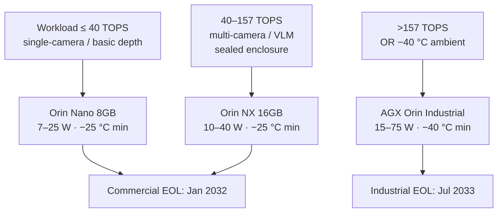

## The gap between an evaluation board and a fielded machine

The Jetson Orin NX developer kit is a capable evaluation platform. It boots JetPack in minutes, connects to USB cameras and CAN adapters over standard headers, and closes a perception demo in an afternoon. Then someone mounts it inside a machine and the problems start.

The power input expects 9–20 V DC through a barrel jack — not the 24 V, 48 V, or 72 V battery bus the robot runs on. The connectors are USB-A, USB-C, and 0.1-inch headers — not M12 screw-lock ports that survive road vibration and IP67 hosing. There is no transient suppression on the supply rail. There is no EMC filtering between the motor drive's PWM switching noise and every ground net on the board. The BOM carries a 1-year development-only warranty with no guaranteed component availability. NVIDIA's own FAQ is direct: "Jetson developer kits are not for production use."

That gap — from evaluation board to fielded controller — is what a custom carrier board closes. Getting there reliably takes six design axes: power tree, thermal management, connector and enclosure standard, EMC architecture, I/O expansion strategy, and a supply-chain plan that spans your product's commercial life. Miss any one of them in the first board spin and a second board spin adds months of schedule and significant contract-manufacturing cost.

This guide walks each axis with the parts, the standards, and the numbers that belong in the schematic before layout starts.

## Module selection: compute headroom versus thermal envelope

The right Jetson Orin module is almost never the most capable one on the spec sheet. It is the one whose compute-to-thermal ratio fits inside your enclosure's heat path at the power mode you will actually run in the field.

| Module | TOPS (standard) | TOPS (Super Mode) | Power modes | Min. operating temp |
|---|---|---|---|---|
| Orin Nano 8GB | 40 | 67 | 7 / 15 / 25 W | −25 °C |
| Orin NX 8GB | 70 | 117 | 10 / 15 / 20 / 40 W | −25 °C |
| Orin NX 16GB | 100 | 157 | 10 / 15 / 25 / 40 W | −25 °C |
| AGX Orin 64GB | 275 | — | 15–60 W† | −25 °C† |
| AGX Orin Industrial | 248 | — | 15–75 W | **−40 °C** |

*TOPS figures: standard mode / JetPack 6.2 Super Mode. Temperature per NVIDIA product documentation and developer forum confirmations.*
*† AGX Orin 64GB (commercial): power-mode range and minimum operating temperature not confirmed at publication. Verify against the current NVIDIA AGX Orin module datasheet before use in a design.*

For most [NVIDIA Jetson](/platform)-based field-robotics programs, the decision collapses to three modules.

**Orin Nano 8GB** fits single-camera guidance, basic depth perception, or any workload that runs comfortably at 40 TOPS and 25 W. JetPack 6.2's Super Mode raises available compute to 67 TOPS without a hardware swap, giving real headroom for model growth between production versions.

**Orin NX 16GB** is the practical ceiling for a sealed industrial enclosure. At 100 TOPS standard (157 TOPS Super Mode) with high-bandwidth LPDDR5 memory, it handles multi-camera perception and vision-language model inference without hitting memory bandwidth as the first bottleneck. The 40 W extended mode, added in JetPack 6.2, is available when the thermal design can handle it — a constraint that tightens in a sealed IP67 housing on a hot summer day.

**AGX Orin Industrial** enters only when two requirements collide: more than 157 TOPS *and* a confirmed −40 °C operational minimum. NVIDIA engineering has confirmed that the commercial Orin NX module's minimum operational temperature is −25 °C. Programs targeting −40 °C ambient — certain [agricultural robotics](/use-cases#agriculture) deployments and hard-rock mining applications — require the AGX Orin Industrial, a separate product family with a different PCB footprint and a lifecycle that extends to July 2033.

Budget compute headroom deliberately. Models grow with every OTA update, and a module running at the edge of its TOPS budget on shipping day will throttle within 18 months of software updates.

## Power tree design for a 12–72 V mobile platform

A mobile robot's battery bus is not a clean supply. A 48 V LiFePO₄ pack throws inductive load-dump transients when a contactor opens under motor current, occasionally reverse-connects during a harness swap at a job site, and delivers surge spikes that routinely exceed 2× nominal voltage under regenerative braking.

The power tree starts with protection, not regulation. ISO 7637-2 defines the transient pulse family for 12 V and 24 V road-vehicle systems: Pulse 1 covers load dump, Pulses 2a/2b cover alternator field-decay transients, and Pulses 3a/3b cover rapid switching events. For 48 V and 72 V mobile platforms, IEC 61000-4-5 surge immunity testing using a 1.2/50 µs waveform covers the higher-voltage analogs. A TVS diode rated to the worst-case pulse energy, combined with a surge-stopper IC (e.g., Analog Devices LT4363) rated for the expected transient peak, prevents transients from reaching the downstream regulator.

After the protection stage, an isolated DC-DC converter steps battery voltage to VDD_IN. The Jetson Orin Nano and Orin NX both accept VDD_IN in the 4.75–20 V range. Isolated DC-DC modules such as the Vicor DCM2322 can span the wide battery input range and deliver regulated VDD_IN with hardware-enforced isolation between the traction bus and the logic domain — sufficient to power an Orin NX, an FPGA co-processor, and a gate-driver stage from a single unregulated battery rail.

One detail that catches first-time carrier board designers: the Jetson module's onboard PMIC generates the sub-5 V SoC supply rails internally. The carrier board is not responsible for discrete 3.3 V or 1.8 V regulation to the module itself. It may need to supply a 1.8 V VDD_IO for certain I/O bank configurations on specific interface options — the exact sequencing requirements are in the NVIDIA Jetson Orin NX Product Design Guide (gated download from NVIDIA's developer portal).

Add inrush limiting before the regulator input. Cold-start inrush on a 48 V bus into a 100 µF input capacitor reaches tens of amps instantaneously. A NTC thermistor or active soft-start circuit limits the peak to what connector contacts and PCB traces can sustain over a five-year field life of daily power cycles.

<figure>
  
  <figcaption>Carrier board power tree for a 12–72 V mobile robot, from battery bus to Jetson VDD_IN.</figcaption>
</figure>
{/* image_brief: Clean technical line-drawing schematic block diagram (black on white, professional embedded-hardware illustration style). Left-to-right flow: "12–72 V Battery Bus" → TVS + surge stopper protection block (label "ISO 7637-2 / IEC 61000-4-5") → reverse-polarity + inrush limiting block → isolated DC-DC converter (label "Vicor DCM2322 or equivalent") → VDD_IN to Jetson Orin NX module + separate 1.8 V VDD_IO rail for I/O banks. FPGA power block branches in parallel from DC-DC output. Label voltage rails numerically at each stage. Commission from a freelance embedded hardware illustrator, or generate via DALL-E with prompt: "clean engineering schematic block diagram, mobile robot carrier board power tree, 12-72V battery bus through transient protection and isolated DC-DC to Jetson module, technical line drawing, white background, black lines, professional style." */}

## Thermal design inside sealed enclosures

The Orin NX 16GB at its 40 W extended mode dissipates 40 W continuously under sustained AI inference. In a sealed IP67 enclosure on a 40 °C summer day with no forced airflow, that heat has nowhere to go except through the enclosure wall. The thermal resistance from silicon junction to ambient determines whether the module runs at full performance or throttles to protect itself.

For conduction-cooled designs — the dominant pattern in field-deployed sealed controllers — a copper heat spreader contacts the module and bolts directly to an aluminum extrusion wall. With adequate contact area and thermal interface material, the thermal resistance from module case to extrusion inner wall can be kept within the budget the overall thermal path requires. The module junction temperature limit (consult the NVIDIA Jetson Orin NX thermal design guide) and a 40 W continuous load dictate a junction-to-ambient thermal resistance well below 2 °C/W — a constraint that rules out convection-only cooling in any sealed enclosure on a hot day.

Operating most carrier boards at the 15 W standard power mode — where Orin NX 16GB still delivers 100 TOPS — halves the heat load and widens the thermal margin significantly. Design the thermal path for the 40 W case; operate at 15 W in normal field conditions and use the 40 W headroom for burst workloads.

The −20 °C to +70 °C industrial ambient range covers the majority of outdoor deployments. Programs targeting −40 °C require the AGX Orin Industrial — the commercial Orin NX minimum is −25 °C, and that boundary is confirmed, not estimated.

## Connectors, enclosures, and vibration qualification

Development headers fail under vibration. USB-A connectors are rated for hundreds of mating cycles — acceptable for a developer bench, not for a machine running 10 hours a day for five years.

M12 circular connectors, standardized under IEC 61076-2-101, are the reason factory floors and field robots share a connector vocabulary. The screw-locking mechanism maintains a rated axial pullout force under continuous vibration and rapid mechanical cycling — the property that makes M12 the de-facto standard for PROFINET, EtherCAT, IO-Link, and robotics harnesses across industrial environments. Available in 2-to-17 pin configurations, M12 handles mixed power and signal up to 250 V / 4 A per contact and data transmission up to 100 MHz, covering 1 GbE (D-coded), CAN, RS-485, and power on the same harness run.

Enclosure protection follows IEC 60529. IP67 means fully dust-tight and sealed against temporary immersion to 1 m for 30 minutes — the right baseline for outdoor robots exposed to rain and road splash. IP69K adds resistance to high-pressure, high-temperature water jets — required for food-processing and livestock equipment that undergoes daily washdown. IP67 and IP69K address different ingress threats; a design that passes IP67 does not automatically pass IP69K.

Vibration and shock qualification uses IEC 60068-2-6 (sinusoidal vibration), IEC 60068-2-27 (single mechanical shock), and IEC 60068-2-64 (broadband random vibration). Define the test profile from your mounting location's vibration signature before laying out the PCB. That choice drives through-hole versus SMT component selection, conformal coating requirements, and solder-joint design rules for heavy components.

## I/O expansion: when the Jetson's native interfaces are not enough

The Orin NX 16GB ships with 2× CAN FD, 3× USB 3.2, multiple MIPI CSI-2 camera lanes, PCIe Gen4, SPI, I2C, and UART. For a perception-focused system with cameras, LiDAR over 10 GbE, and a single CAN bus to a vehicle chassis, the native I/O typically covers the design.

For motor control, it does not. Closing a servo current loop at 1 kHz from Linux requires a deterministic SPI transaction on every cycle with no missed deadlines — a guarantee Linux scheduling cannot provide. Publishing EtherCAT packets with cycle times ≤ 100 µs and jitter well below 1 µs requires an FPGA-based Fieldbus Memory Management Unit; standard Linux Ethernet drivers cannot approach that timing. Implementing ISO 13849-1 PLd or PLe safety interlocks — emergency-stop inputs, light-curtain channels, gate-driver enables — requires hardware timing that Linux cannot bound to PFHd < 10⁻⁶ per hour (PLd) or < 10⁻⁷ per hour (PLe).

These are the conditions that justify adding an FPGA co-processor to the same carrier board. The [FPGA real-time control](/platform#capabilities) layer owns the motor PWM outputs, encoder interfaces, EtherCAT slave stack, and safety I/O. The Jetson handles perception, planning, and setpoint generation over a PCIe or SPI bridge on the same PCB. The result is an [AI-native controller architecture](/glossary/ai-native-controller-primer) where deterministic hardware timing and AI inference share a single production board. The [FPGA + Jetson hybrid architecture guide](/guides/fpga-jetson-hybrid-architecture) covers interconnect selection, FPGA family trade-offs, and the full safety partitioning pattern in detail.

## EMC and EMI: the ground-plane reality

Motor drives and switching converters are EMI sources by construction. A PWM inverter switching at 20 kHz with 100 ns edges generates harmonics across the MHz range. Unfiltered, a typical traction-motor drive exceeds FCC Part 15 and CISPR conducted emission limits by 25–30 dB in the 150 kHz–30 MHz band. EN 55032 (technically identical to CISPR 32) is the primary emissions standard for multimedia and computing equipment; Class B limits apply to commercial and light-industrial deployments.

The first-line defense is ground-plane architecture. A single solid ground plane with component zone partitioning — digital, analog, power conversion, and motor control zones with controlled high-frequency return paths — is more predictable than physically split planes, which introduce their own resonance paths when trace lengths exceed 10 cm. Galvanic isolation between the digital domain (Jetson and FPGA) and the motor drive domain handles the highest-risk coupling path. The ADI ADuM4154 iCoupler — rated at 5 kV RMS galvanic isolation, 17 MHz clock support, and 14 ns typical propagation delay — crosses that boundary fast enough for SPI to a gate driver (e.g., TI DRV8353) at production-relevant data rates.

On the radiated side: shielded harnesses and ferrite chokes on motor phase leads reduce the effective antenna area of the motor cable. High-bandwidth decoupling close to each switching node — X5R ceramics rated for actual rail voltage, not de-rated — suppresses switching-node transients before they propagate.

## Lifecycle and supply-chain planning

A production program shipping in 2027 with a 7-year commercial life needs components available through 2034. The Jetson Orin module lifecycle shapes that plan.

Commercial modules — Orin Nano, Orin NX, AGX Orin — are available through January 2032. The AGX Orin Industrial extends to July 2033. NVIDIA's policy requires a minimum of 8 months' advance notice before last shipment, in compliance with JEDEC JESD-046. For any program whose planned end-of-production date exceeds January 2031, the design-in decision should include a module-transition plan from day one — whether to redesign around NVIDIA's successor module family, qualify a footprint-compatible replacement, or buffer the final production run.

The BOM longevity analysis extends beyond the compute module. Multilayer ceramic capacitors above 10 µF go on allocation during supply-chain disruptions more reliably than most ICs. A production program designates second-source part numbers for every MLCC above 10 µF and for every TVS diode in the power tree *before* the first production run, not after the first shortage notification.

## Build or specify: what the economics look like

Building a custom carrier board in-house is a legitimate path for organizations that already employ the required team. That team covers at minimum two experienced FPGA engineers, an embedded Linux engineer, a hardware engineer, and EMC compliance management. Budget $900K–$2M+ and 18–24 months end-to-end — including a second board spin, because the first bring-up almost always surfaces EMC surprises, connector placement constraints, or thermal interactions that the second spin corrects.

The co-development alternative compresses that timeline. A qualified partner delivers board architecture in 5 business days and physical prototypes in 3–5 months on standard contract manufacturing. Under a customer-pays-for-hardware model, the NRE is $0. The trade-off is dependency on the partner's design process and continuity — which makes vendor selection criteria non-trivial.

**Vendor evaluation checklist for a carrier-board partner:**
- Does the customer own the schematic files and Gerber outputs at program completion?
- Who owns the firmware update cycle for the FPGA bitstream and Jetson BSP?
- Can the partner provide witness-test support for FCC / CE / IP certification?
- What is the partner's documented prototype cadence?
- Is there a second-source strategy for the FPGA and critical passives?
- Does the partner hold current Jetson design-in program standing (NVIDIA Inception or NCP membership)?

## What TACTUN does

TACTUN designs the control spine for robotics programs across [use cases](/use-cases) from construction automation to underwater inspection — wherever the machine runs on a battery bus in a demanding environment. The carrier board pairs a custom FPGA architecture for deterministic real-time control with Jetson edge AI compute, configured to your motor mix (servo, stepper, hydraulic, pneumatic), your voltage bus, and your connector standard. The customer owns the AI stack and the application logic; TACTUN owns the spine underneath.

The Jetson robotics board is prototype-ready, with production units expected to ship within 2–3 months. The founding team brings 14 years of systems-integration experience across industrial and field-robotics programs, plus 2 USPTO-granted patents and current NVIDIA Inception Program membership. Details on the engagement structure are on the [how we work](/platform#how-we-work) page: board architecture in 5 business days, physical prototypes in 3–5 months, $0 NRE — the customer pays only for production hardware.

---

If the design axes above — module selection, power tree, thermal, connectors, EMC, and lifecycle planning — look right for your machine, [contact us](/contact) with the actuator list, the battery voltage, and the certification targets. We will tell you whether the spine we already build maps to your program.
