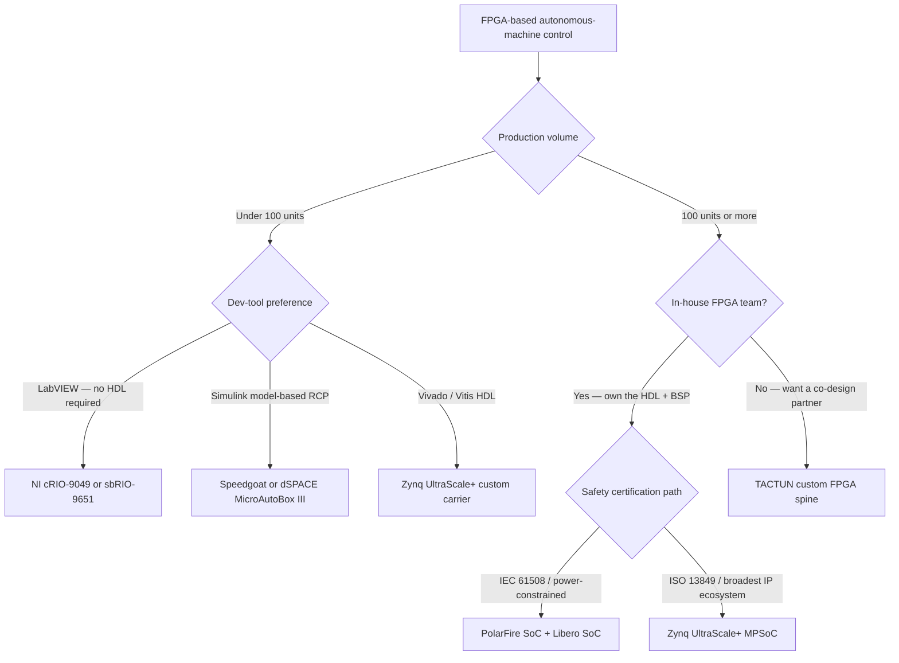

## The platform decision nobody talks about honestly

Hobby-grade drone autopilots run at 400 Hz. A field-robotics control loop closing on hydraulic actuators needs 1 kHz with sub-millisecond jitter — and a hard guarantee that no Linux scheduler hiccup will miss a deadline. Once you've ruled out RTOS-on-Cortex-M for the AI side and ROS-on-Jetson for the real-time side, you reach the same answer everyone reaches: an FPGA for the [FPGA real-time control](/platform/#capabilities) layer and a custom PCB that ties it together with your compute. The interesting question is which FPGA platform, and why.

"Use an FPGA" is not a decision — it's the start of three more decisions: which FPGA family, which dev-tool stack, and whether you buy a turnkey system or design a custom carrier board. Each choice carries a different break-even volume, certification pathway, and 10-year lifecycle commitment. Getting this wrong costs a 6-to-12 month detour and, at production scale, potentially millions of dollars in per-unit overcost.

Most "top FPGA controller" articles are marketing pages from NI, dSPACE, and Speedgoat, or hobbyist lists that mix microcontrollers with FPGAs and dev boards with deployable hardware. This guide covers 10 platforms engineers actually deploy in autonomous machines: the raw SoC silicon you design a carrier board around, the turnkey boxes you wire up and program, and the co-designed options in between. The ranking criteria are declared up front and applied to every platform on the same terms.

One clarification on scope — autonomous machines here means field robots, AMRs, CNC machines, agricultural vehicles, marine vessels, and industrial manipulators. The determinism requirements range from 1 kHz (1 ms) for hydraulic and pneumatic actuators up to 10 kHz (100 µs) for high-bandwidth servo axes. That range covers most programs in this space. If your application sits at 400 Hz, a quality RTOS on a Cortex-M7 may be sufficient; if you need sub-100 µs with hard guarantees under AI inference load, you need an FPGA.

What is not on this list, and why: pure MCU motor drivers (STM32, ESP32 — sequential execution, not FPGA), single-board computers without FPGA fabric (Raspberry Pi, BeagleBone), dedicated motor drivers (Trinamic, ODrive, VESC — drives, not controllers), developer eval kits (Zynq ZCU102 is not a production platform), and proprietary in-house FPGA designs that are not purchasable (Boston Dynamics, iRobot). Those are different hardware classes and a different article.

---

## Ranking criteria — declared up front

Seven criteria separate a platform that fits a given program from one that wastes six months of engineering time:

1. **Deterministic control-loop frequency.** What is the hard minimum achievable cycle time with no software scheduler involved? 1 kHz (1 ms) covers most hydraulic and pneumatic actuators; 10 kHz (100 µs) covers high-bandwidth servo axes; sub-100 µs is torque-control territory.
2. **Peripheral library maturity.** Does pre-built EtherCAT master IP, motor encoder interfaces, SPI-DMA, and CAN/J1939 already exist for this FPGA family, or are you writing IP blocks from scratch?
3. **Dev-tool ecosystem.** Vivado (Zynq), Quartus Prime (Cyclone V), Libero SoC (PolarFire), LabVIEW FPGA (NI), or Simulink HDL Coder (Speedgoat, dSPACE). Toolchain choice frequently dominates platform choice — a team fluent in Simulink HDL Coder will reach a working prototype faster on Speedgoat than on a raw Zynq, regardless of the underlying silicon.
4. **Safety certification track record.** Has anyone successfully certified a design on this platform to ISO 13849-1 PL d, IEC 61508 SIL 2, or IEC 62061? First-time certification on an unfamiliar platform adds substantial time and cost.
5. **Price per deployed unit at 100–1,000 units.** At 500 machines, the difference between approximately $8K–$15K for an NI cRIO unit and approximately $300–$1,500 for a custom Zynq carrier board is a program-level budget decision.
6. **Integration burden.** Raw SoC chip (maximum flexibility, maximum engineering work), carrier-board module (NI sbRIO, Synapticon Circulo), or turnkey box (cRIO, Speedgoat, MicroAutoBox).
7. **Long-life supply commitment.** A robot in the field for 15 years needs a parts supply for 20. AMD commits Zynq UltraScale+ devices through 2045. Altera's roadmap post-Silver Lake divestiture has not been published past the current product generation.

---

## The 10 platforms

### 1. AMD/Xilinx Zynq UltraScale+ MPSoC

**Best for:** Production autonomous-machine programs where IP ecosystem breadth and 20-year supply security matter most.

The Zynq UltraScale+ is the reference architecture for real-time-with-Linux SoC designs. It pairs a quad-core ARM Cortex-A53 at 1.5 GHz (application processing) with a dual ARM Cortex-R5F at 600 MHz (real-time processing), plus FPGA programmable logic fabric spanning 103K to 1,143K logic cells on AMD's 16nm FinFET+ process. Aggregate PS-PL bandwidth exceeds 150 GB/s.

The PL fabric, clocked at 200+ MHz, is architecturally capable of approximately sub-1 µs feedback control loops with the right FPGA IP [≈ approx, based on 200+ MHz PL clock rates] — no Linux scheduler or RTOS context switch involved. The R5F cores handle deterministic 100 µs–1 ms loops without any FPGA involvement. The A53 cluster runs Linux for path planning, sensor fusion, and connectivity.

Full-run power (all domains active) is 5–15 W; with the Full Power Domain gated off, it drops to 2–5 W. AMD commits support for UltraScale+ devices through 2045 — the longest explicit lifecycle commitment in this comparison. Vivado/Vitis is a heavy dev toolchain, but also the best-documented, with a mature third-party ecosystem of motor-control and EtherCAT IP. Intel published a white paper demonstrating ISO 13849-1 Category 3 PL d / SIL 2 architecture on SoC FPGA; the certification path is established.

The weak point is toolchain weight: a team without prior FPGA experience will spend months getting productive in Vivado. Zynq UltraScale+ is a chip, not a controller — it still needs a carrier board, BSP, and software stack.

---

### 2. Microchip PolarFire SoC

**Best for:** Battery-powered or thermally constrained robots; designs targeting IEC 61508 certification on the most direct available toolchain path.

PolarFire SoC pairs a 5-core 64-bit RISC-V Microprocessor Sub-System with Microchip's 28nm FD-SOI process and up to 460K logic elements. The RISC-V ISA eliminates ARM licensing questions — a relevant factor for defense-adjacent, sovereign, and export-controlled programs where processor ISA provenance matters.

Power is the headline differentiator: Microchip claims 30–50% total power savings versus comparable SRAM-based SoC FPGAs [vendor-claimed, source: microchip.com]. The FD-SOI process also delivers a substantially lower soft error rate than SRAM FPGAs exposed to radiation or neutron flux — relevant for [agricultural robotics](/use-cases/#agriculture), outdoor construction, and marine deployments where cosmic ray neutrons are a real failure mode.

Security features are built in: Physical Unclonable Function (PUF) using Intrinsic-ID Quiddikey-Flex IP and a hardware Root of Trust with immutable boot ROM for secure boot. Microchip's Libero SoC Design Suite carries TÜV Rheinland certification to IEC 61508 — the only SoC FPGA toolchain on this list with that credential, and a significant accelerator for functional safety programs targeting SIL 2 or SIL 3.

The trade-offs: Libero is rated harder to use than Vivado by most embedded engineers who have used both, and the third-party IP ecosystem is smaller. PolarFire SoC is the right choice when power budget, radiation tolerance, security, and IEC 61508 alignment matter more than ecosystem breadth.

---

### 3. Intel/Altera Cyclone V SoC

**Best for:** Cost-sensitive designs where a dual Cortex-A9 + FPGA combination is sufficient and the team already has Quartus Prime expertise.

Cyclone V SoC uses TSMC's 28LP process, pairs a dual-core ARM Cortex-A9 at 925 MHz with up to 110K logic elements, and offers PS-PL interconnect bandwidth exceeding 100 Gbps. It has been a workhorse for industrial control for over a decade, with an established library of motor control and EtherCAT IP in the Quartus ecosystem.

The significant recent development: Intel sold a 51% controlling stake in Altera to Silver Lake, completing the transaction in September 2025 at an implied $8.75 billion valuation. Altera is now an independent pure-play FPGA company with Raghib Hussain as CEO. Quartus Prime (including the free Lite version) remains the supported toolchain for Cyclone V. The long-term roadmap beyond the current device generation has not been published; new designs targeting a 10-year+ support horizon should factor that uncertainty in.

If your team has an existing Quartus workflow and you're building cost-sensitive systems under 200 units, Cyclone V SoC is a defensible choice today. For programs requiring supply security past 2033, Zynq UltraScale+ or PolarFire SoC carry a more explicit long-term commitment.

---

### 4. Lattice CrossLink-NX

**Best for:** Sensor aggregation, video bridging, and timing-sensitive glue logic alongside a main SoC — not as a standalone system controller.

CrossLink-NX sits on Lattice's Nexus 28nm FD-SOI platform. The NX-17 has 17K logic cells; the NX-40 reaches 39K. There is no embedded CPU — this is a pure FPGA fabric. Lattice claims up to 75% power reduction versus competing FPGAs in the same class [vendor-claimed], with a soft error rate up to 100× lower than SRAM-based alternatives [vendor-claimed].

CrossLink-NX is not a control system; it is a fast bridge. It handles MIPI CSI-2 aggregation, multi-camera synchronization, and timing-sensitive glue logic between heterogeneous components at under 1 W. In a typical autonomous-machine architecture, a CrossLink-NX-40 sits between a multi-camera sensor array and a Zynq or Jetson, pre-processing frame data before it hits the main compute. It belongs in that specific role — not as the platform running a closed-loop motor control algorithm.

Include CrossLink-NX on the BOM when your Zynq or PolarFire carrier board needs to aggregate six camera streams and the main SoC's FPGA fabric is already committed to real-time control. Use Lattice's Radiant design suite for this work.

---

### 5. NI cRIO-9049

**Best for:** Fastest time to first deterministic loop; LabVIEW-native teams; pilot programs where NI's industrial certifications and support contracts justify the cost.

The cRIO-9049 is NI's highest-performance CompactRIO chassis: Intel Atom quad-core at 1.6 GHz, Xilinx Kintex-7 325T FPGA, 8-slot I/O chassis, 16 GB storage, and TSN (Time Sensitive Networking) for deterministic Ethernet. No HDL required — LabVIEW FPGA generates the bitfile from graphical code.

Time to first deterministic loop is measured in days, not months. LabVIEW FPGA on the Kintex-7 325T generates deterministic bitfiles that execute in the µs-to-ms range, well within the cycle-time envelope required for servo and hydraulic loops. For a team validating a control algorithm on a first pilot machine, that speed matters.

The trade-offs are per-unit economics and lock-in. Per-unit pricing is quote-based; secondary-market and academic-pricing evidence places complete cRIO-9049 systems in the approximately $8K–$15K+ range [≈ approx]. Every LabVIEW FPGA line of code stays permanently on NI hardware — there is no migration path to a custom Zynq carrier. Ongoing software license costs must factor into any 10-year ownership model alongside the hardware purchase price.

---

### 6. NI sbRIO-9651

**Best for:** OEM programs that need board-level form factor and LabVIEW FPGA workflow in a package sized for a custom machine enclosure.

The sbRIO-9651 packs a Xilinx Zynq-7020 (dual-core Cortex-A9 at 667 MHz) with 512 MB DRAM, 512 MB NVM, 16 DMA channels, and the NI Linux Real-Time OS onto a single board. The same LabVIEW FPGA workflow as cRIO applies, so engineering investment transfers directly.

The sbRIO is meaningfully cheaper per unit than a full cRIO chassis, and the board-level form factor removes chassis overhead. The constraint is that the Zynq-7020 is an older part — 28nm Cortex-A9 era, lower logic density and lower memory bandwidth than UltraScale+. For a 3-axis Cartesian robot with EtherCAT servos, the Zynq-7020 fabric is sufficient and sbRIO-9651 is a pragmatic production platform. For a 7-DOF arm running model inference alongside motor control, the logic density ceiling becomes a real constraint before long.

---

### 7. Speedgoat Real-Time Target Machine

**Best for:** Model-based design teams validating a Simulink control algorithm before committing to production hardware.

Speedgoat target machines pair Xilinx Kintex or Virtex FPGAs with Intel Xeon or Core i7 processors, exposed directly to Simulink Real-Time and Simulink HDL Coder. Build your control algorithm in Simulink, press build, and the target machine runs it in real-time with µs-range determinism — no VHDL, no bitfile management. This is the right environment for a controls engineer who thinks in block diagrams, not HDL.

Speedgoat is primarily a rapid control prototyping (RCP) and hardware-in-the-loop (HIL) tool. The physical packaging is not rated for field deployment, per-unit cost is high, and the system is calibrated for lab use. The correct workflow: Speedgoat validates the algorithm in the lab, then that algorithm is ported to a production Zynq or cRIO. Shipping Speedgoat targets into deployed machines means paying lab-prototyping prices for production units indefinitely.

---

### 8. dSPACE MicroAutoBox III

**Best for:** Automotive and autonomous-vehicle rapid control prototyping; teams already integrated into the dSPACE ecosystem.

The MicroAutoBox III pairs a user-programmable AMD Kintex-7 FPGA with a quad-core ARM processor. I/O coverage reflects its automotive lineage: CAN, LIN, FlexRay, Gigabit Ethernet, and 100/1000 BASE-T1 automotive Ethernet. Model-based development uses MATLAB/Simulink plus ConfigurationDesk; the FPGA is programmable via Simulink HDL Coder or VHDL.

Like Speedgoat, MicroAutoBox III is a prototyping tool. It is the right platform if your team has an established dSPACE vehicle dynamics or ADAS pipeline and you're adding autonomous function to a truck, forklift, or mining vehicle. It is the wrong platform if you're deploying a fleet of field robots and need a per-unit cost that fits a production BOM — MicroAutoBox pricing is not public, but it is commensurate with automotive prototyping equipment, not production controllers. The automotive-specific interface set also limits fit for non-automotive machine programs.

---

### 9. Synapticon SOMANET Circulo

**Best for:** Multi-axis robot arms where each joint needs its own high-bandwidth servo drive mounted inside the joint.

SOMANET Circulo is a disk-shaped all-in-one motor driver and servo controller designed to mount directly inside a robot joint. Its torque/current control loop runs at 16 kHz (62.5 µs) per firmware v4.2.0 documentation [source: doc.synapticon.com]. The EtherCAT communication interface supports up to 4 kHz cycle rate to an upstream system controller.

This is not a system controller — it is a per-joint servo drive. Each Circulo module handles one axis. For a 6-DOF arm, you run six modules on a single EtherCAT bus, with a Zynq- or Cortex-A-based master handling path planning, state management, and safety logic above the bus. The value proposition is integrating drive electronics directly into the joint, reducing cable runs and eliminating a separate servo amplifier panel. When you need a system controller to sit above the SOMANET bus, you need something from the rest of this list — Circulo is the leaf node, not the root.

---

### 10. TACTUN Custom FPGA Spine

**Best for:** AI-native robotics programs that need FPGA-grade determinism AND on-device AI compute on the same board, at production volumes where turnkey per-unit cost is not viable.

The [TACTUN platform](/platform/) builds on a Zynq UltraScale+ MPSoC base, adding NVIDIA Jetson compute integration on a customer-specific carrier board. This is not a catalog product — it is a co-designed board where the carrier geometry, connector set, I/O count, thermal solution, and power budget match your machine's enclosure and your production BOM. The FPGA fabric handles deterministic motor control, safety I/O, and EtherCAT; the Jetson handles on-device AI inference and perception. Both live on one board, without a serial bottleneck between the real-time layer and the AI layer — this is the control spine for an [AI-native machine](/glossary/ai-native-controller-primer/).

The economics: $0 NRE, board architecture delivered in 5 business days, physical prototypes in 3–5 months. A team building the equivalent in-house faces $900K–$2M+ and 18–24 months — the cost and timeline TACTUN was designed to replace. For programs above approximately 100–500 units [≈ approx], the custom per-unit BOM undercuts turnkey systems significantly while delivering capabilities no off-the-shelf box matches: custom I/O count, custom enclosure fit, Jetson-class AI compute, and long-life component sourcing planned from day one.

TACTUN's founding team brings 14 years of systems integration experience and has shipped 800+ controllers across industrial automation and robotics programs. The Jetson-based robotics board is in prototype, with production expected within 2–3 months (as of 2026 Q1). For a detailed look at what co-design versus in-house build actually costs, see the [build-vs-buy analysis for robotics controllers](/blog/build-vs-buy-robotics-controller/).

---

## Platform decision flowchart

## At-a-glance comparison

| # | Platform | FPGA fabric | On-chip CPU | Dev tool | Achievable min. cycle | Per-unit cost (≈) | Best fit |
|---|---|---|---|---|---|---|---|
| 1 | Zynq UltraScale+ MPSoC | 103K–1,143K LCs | 4× A53 1.5 GHz + 2× R5F 600 MHz | Vivado/Vitis | ≈ sub-1 µs (PL) | BYO carrier | Production custom |
| 2 | PolarFire SoC | Up to 460K LCs | 5-core RISC-V 64-bit | Libero SoC | ≈ sub-1 µs (PL) | BYO carrier | Safety cert + low power |
| 3 | Cyclone V SoC | Up to 110K LEs | 2× A9 925 MHz | Quartus Prime | 100 µs+ | BYO carrier | Cost-sensitive |
| 4 | Lattice CrossLink-NX | Up to 39K LCs | None (pure FPGA) | Radiant | Co-processor only | BYO carrier | Sensor aggregation |
| 5 | NI cRIO-9049 | Kintex-7 325T | Atom quad-core 1.6 GHz | LabVIEW FPGA | ~100 µs–1 ms | ≈ $8K–$15K+ | Fast-to-deploy, LabVIEW |
| 6 | NI sbRIO-9651 | Zynq-7020 | 2× A9 667 MHz | LabVIEW FPGA | 100 µs+ | Lower than cRIO | OEM board-level |
| 7 | Speedgoat target | Kintex/Virtex | Xeon / Core i7 | Simulink RT + HDL Coder | µs-range | High | RCP / HIL lab use |
| 8 | dSPACE MicroAutoBox III | AMD Kintex-7 | Quad-core ARM | MATLAB/Simulink | µs-range | High | Automotive RCP |
| 9 | Synapticon SOMANET Circulo | Internal FPGA | Embedded on-drive | SOMANET Studio | 62.5 µs (16 kHz torque) | Mid | Per-joint servo drives |
| 10 | TACTUN custom FPGA spine | UltraScale+ + carrier | Jetson + R5F | TACTUN platform SDK | Sub-1 µs to 100 µs | $0 NRE; custom volume BOM | AI-native production |

---

## Turnkey vs. custom: the economic argument

The break-even calculation drives more platform decisions than any single technical criterion. Turnkey systems — NI cRIO, Speedgoat, dSPACE — carry low upfront integration cost but a high per-unit price. Secondary-market and academic-pricing evidence places complete turnkey controllers in the approximately $5K–$30K range per deployed unit [≈ approx]; a cRIO-9049 chassis sits at the lower end, a fully equipped Speedgoat or dSPACE system at the higher end. None of these vendors publishes list pricing publicly — all three are quote-based.

Custom carrier boards built on Zynq UltraScale+ or PolarFire SoC, manufactured at production volume, can reach approximately $300–$1,500 per unit in BOM cost [≈ approx]. The NRE to get there — board design, firmware stack, safety validation — runs $900K–$2M+ if built in-house over 18–24 months. At approximately 100–500 units [≈ approx], the custom approach starts to recover that investment. Above 500 units, it almost always wins on per-unit economics.

The hidden variable is software lock-in. Turnkey systems bundle their dev-tool ecosystems tightly — and switching costs are substantial. Every LabVIEW FPGA bitfile is permanently coupled to NI hardware. Every Simulink HDL Coder model requires a Simulink Real-Time license to execute. Factor those ongoing license costs into a 10-year ownership model alongside the hardware purchase price. A program that deploys 200 machines and expects 12 years of field life carries a different total cost of ownership for a cRIO-based fleet versus a custom Zynq fleet.

The software lock-in question also affects your team's long-term skill set. A team that spent three years building LabVIEW FPGA expertise cannot easily move to a different platform; the platform decision becomes a hiring constraint. For programs in [construction and mining](/use-cases/#construction), [marine and underwater](/use-cases/#marine), and similar verticals where a 10-year product lifecycle is standard, the staffing implications of toolchain lock-in matter as much as the hardware cost. For an engineering team evaluating whether to build or buy the control layer for a new machine program, see the [control electronics guide for field robots](/blog/control-electronics-for-field-robots/).

---

## What TACTUN does in this picture

TACTUN designs the carrier board around your machine — not the other way around. The TACTUN platform pairs Zynq UltraScale+ FPGA fabric for deterministic motor control, safety I/O, and EtherCAT with NVIDIA Jetson compute for on-device AI inference, running over a single custom PCB sized and connectorized for your enclosure. This is the control spine: the real-time substrate that closes motor loops at 1–10 kHz, manages safety state per ISO 13849-1, and passes structured data to the AI layer without the latency penalty of a serial bus or off-board compute module. The AI layer — your perception models, planning algorithms, operator interfaces — runs on the Jetson. TACTUN provides the substrate that makes both layers possible on one board.

TACTUN's position on this list is specific: it belongs when off-the-shelf turnkey is too expensive at the program's production volume, and when pure-Zynq DIY integration is more than the team wants to own. The 5-business-day board architecture turnaround and $0 NRE model means you start with a reference design tuned to your machine, not a blank Vivado project and a Kintex eval board. For programs in agricultural robotics, marine autonomy, or industrial automation — where the machine geometry dictates a custom enclosure anyway — this is the path that closes the gap between "we need custom hardware" and "we have custom hardware in production." See the [FPGA+Jetson hybrid architecture guide](/guides/fpga-jetson-hybrid-architecture/) for the technical integration pattern.

---

## Next step

The right platform depends on your production volume, your team's HDL depth, and how much of the software stack you want to own long-term. For programs where AI-native perception and deterministic real-time control need to share a single board — without paying turnkey prices per unit — [contact us](/contact/). We'll tell you honestly whether TACTUN fits, or whether a NI cRIO, custom Zynq, or PolarFire approach is the better call for your specific program.
