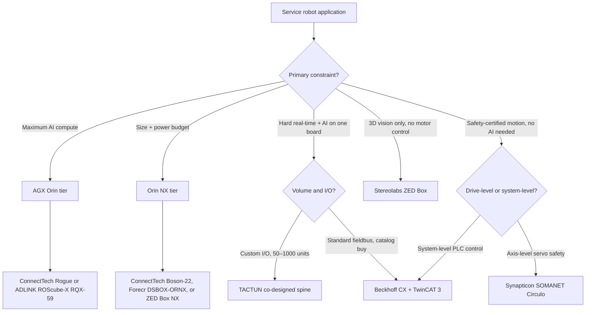

## The problem you're solving before you pick a brain

Specifying a service-robot control platform sounds simpler than it is. You need AI compute for perception — object detection, semantic mapping, depth estimation. You need deterministic real-time control for motors — servo loops closing at 500 Hz to 1 kHz, safety interlocks that cut power in hardware time. And you need both in a form factor that fits your enclosure, survives the operating environment, and holds a stable BOM for five years.

The [NVIDIA Jetson](/platform) family handles the perception side well. A Jetson Orin NX 16 GB delivers 157 TOPS in a 25 W envelope — enough for concurrent object detection and stereo depth processing. But Linux scheduling jitter on Jetson, even with PREEMPT_RT enabled, runs 20–200 µs under well-controlled conditions, with tail latencies climbing higher under load. The Jetson RT kernel remains Developer Preview quality as of JetPack r36.5. For a corridor robot correcting wheel velocity at 200 Hz, that is fine. For a collaborative arm closing a force control loop at 1 kHz, it is not.

The PLC-grade platforms solve the real-time half. Beckhoff's TwinCAT 3 achieves EtherCAT cycle times as low as 50 µs with its XFC technology and can coordinate up to 256 axes from a single controller. Synapticon SOMANET Circulo runs its torque and current control loop at 16 kHz (firmware v4.2.0). But neither ships with on-device AI inference compute. If your robot needs both closed-loop force control and camera-based scene understanding, you're integrating two separate control planes, synchronizing them over a fieldbus, and hardening both for EMI — then supporting that combined BOM for the life of the product.

That integration cost is the real problem. Most programs underestimate it by 12–18 months. Building an equivalent AI-plus-real-time-control platform from scratch typically costs $900K–$2M+ and 18–24 months of engineering time. The platforms in this list represent the alternatives — each with a different trade-off between AI headroom, determinism, and integration burden.

<figure>
  
  <figcaption>The control architecture gap: perception-only Jetson carriers versus a co-designed AI-plus-real-time spine.</figcaption>
</figure>
{/* image_brief: Line-drawing / technical diagram with two side-by-side block diagrams. Left block: Jetson module → carrier board → "fieldbus →" separate motor controller; shows the integration boundary as a dashed line. Right block: Jetson module + FPGA on one PCB, shared power rail, direct motor I/O lines. Clean monochrome style consistent with technical datasheets. Commission from a technical illustrator or generate via DALL-E with prompt: "Two-panel engineering block diagram, white background, monochrome, technical line-drawing style: left panel labeled 'Jetson carrier + separate motor controller' showing two boxes connected by a fieldbus dashed line; right panel labeled 'Co-designed AI + FPGA spine' showing one unified box with motor drive outputs." */}

## Eight criteria, ranked and declared up-front

Every platform review has hidden criteria. Here are the eight we scored, stated before the rankings:

| # | Criterion | What we measured |
|---|---|---|
| 1 | **AI compute headroom** | Peak TOPS and sustained inference wattage |
| 2 | **Real-time determinism** | Control-loop rate or scheduling jitter floor |
| 3 | **Motor-control I/O** | Native servo, stepper, hydraulic, pneumatic support |
| 4 | **Power envelope** | Sustained inference TDP, minimum operating wattage |
| 5 | **Software ecosystem** | ROS 2 maturity, EtherCAT support, vendor SDK quality |
| 6 | **Industrial lifecycle** | EOL horizon, BOM stability at 100–1,000 unit volumes |
| 7 | **Price-per-deployment** | Cost signal at 100–1,000 units (where published) |
| 8 | **Certification story** | ISO 13849-1, IEC 61508, FSoE support |

No single platform wins every column. The ranking reflects the full eight-criterion score for a general-purpose service-robotics program.

## The 10 platforms

### 1. NVIDIA Jetson AGX Orin — the compute reference

The AGX Orin delivers up to 275 TOPS across its module family (32 GB, 64 GB, and Industrial variants) with a configurable power envelope from 15 W to 60 W. NVIDIA Ampere GPU architecture and dual Deep Learning Accelerators handle simultaneous object detection, semantic segmentation, and depth inference without thermal throttling in the 40 W mode. The Industrial variant carries a 10-year lifecycle commitment.

**Strengths:** Highest TOPS of any sub-100 W embedded module; deep ROS 2 ecosystem; NVIDIA Isaac ROS packages accelerate perception pipeline bring-up; long Industrial lifecycle simplifies BOM planning.

**Weaknesses:** Requires a carrier board to be deployable — the module alone ships with no power conditioning, no I/O, and no mechanical interface. Linux scheduling jitter (20–200 µs with PREEMPT_RT, Developer Preview on JetPack r36.5) means real-time motor control must be handled externally. No native motor-control I/O.

**Best for:** Perception-heavy applications with four or more cameras — inspection robots, AMRs in unstructured environments, surgical assist vision platforms.

---

### 2. NVIDIA Jetson Orin NX — compact AI for cost-sensitive programs

The Orin NX 16 GB delivers 157 TOPS at a configurable 10–25 W — the smallest Jetson form factor currently available — integrating NVIDIA Ampere architecture and dual DLAs into a module that fits where an AGX Orin won't. The 8 GB variant drops to 70 TOPS, trading compute headroom for a lower power floor.

**Strengths:** Best TOPS-per-watt in the Jetson family at this price tier; large ecosystem of production-qualified Orin NX carriers (Boson-22, DSBOX-ORNX, ZED Box) for almost every deployment context; same JetPack SDK as AGX Orin means software ports over cleanly.

**Weaknesses:** Real-time determinism identical to AGX Orin — PREEMPT_RT jitter still 20–200 µs under well-controlled conditions; no on-module motor I/O. The 8 GB variant constrains concurrent inference workloads.

**Best for:** Delivery robots, concierge robots, and compact mobile platforms where AI workload fits within 157 TOPS and motor count stays at four axes or fewer.

---

### 3. TACTUN co-designed AI-native control spine — best for OEM production

TACTUN co-designs a board that pairs a Jetson module (Orin NX or AGX Orin, matched to the application's AI compute requirements) with a custom FPGA block on a single PCB. The FPGA handles deterministic real-time control — servo, stepper, hydraulic, and pneumatic actuators — while the Jetson processes camera and sensor feeds for perception. Because both compute planes share the same board, there is no fieldbus boundary between AI inference and the control loop.

The result is sub-10 µs real-time latency alongside up to 275 TOPS of AI compute in one package — the combination that no off-the-shelf carrier achieves. The tailored I/O design matches your actuator set: connector types, pinout, power rails, and EMI layout are all defined for your specific machine, not a generic use case. Safety logic and machine state management run on-chip.

**Strengths:** Sub-10 µs control loop latency alongside GPU-class inference; tailored I/O — no integration work to add motor control or ruggedize for EMI; $0 NRE (customer pays only for production hardware); board architecture scoped in 5 business days; prototypes in 3–5 months.

**Weaknesses:** Not a catalog item — production units take 3–5 months; higher per-unit cost than an off-the-shelf carrier at low volumes; requires a co-design engagement, not a datasheet order.

**Best for:** OEMs running 50–1,000 units per year where integration cost over a five-year deployment exceeds the co-design timeline, and where sub-100 µs control loops or custom I/O are mandatory. This is the [AI-native controller](/glossary/ai-native-controller-primer) architecture applied to a production-grade control spine.

---

### 4. ConnectTech Boson-22 / Rogue — production-qualified Jetson carriers

ConnectTech designs production-grade Jetson carrier boards for robotics and industrial OEMs. The **Boson-22** targets Jetson Orin NX and Orin Nano with four 22-pin MIPI CSI-2 camera connectors, dual Gigabit Ethernet, dual USB NVMe slots, and a 9–36 V wide-input power rail — direct camera integration without an adapter board. The **Rogue-RX** (AGX203) targets harsh-environment AGX Orin deployments with positive-locking high-speed connectors, 2× 10GbE ports, and HDMI 2.1 output.

**Strengths:** Production-quality carrier designs with full Jetson compliance; wide power-input range; strong hardware support track record; MIPI CSI-2 direct-mount simplifies camera integration.

**Weaknesses:** No native motor-control I/O; real-time determinism bounded by Jetson Linux; safety certification falls entirely on the system integrator.

**Best for:** Teams that have already solved motor control externally and need a well-supported, compliant carrier for the perception stack.

---

### 5. Forecr DSBOX-ORNX — industrial fanless box for field deployments

An industrial fanless PC around the Jetson Orin NX: 110 × 130 × 67 mm, 760 g, rated −25 °C to +55 °C on a 9–28 V DC input. The DSBOX-ORNX ships with 1× CAN bus, 1× RS232, 1× RS422, 2× USB 3.1, and dual M.2 NVMe slots. No moving parts. This is the platform to reach for when you need Orin NX compute inside a field-service or outdoor enclosure without designing a carrier board.

**Strengths:** Off-the-shelf availability; widest operating temperature range of any Orin NX solution in this list; CAN and serial interfaces built in; fanless design eliminates filter maintenance.

**Weaknesses:** CAN interface is limited for multi-axis servo control; no EtherCAT or dedicated safety I/O; fixed I/O map can't be adapted without a custom design.

**Best for:** Outdoor inspection robots, utility vehicles, and field-service mobile platforms in temperature-variable environments where a standard CAN/serial I/O set is sufficient.

---

### 6. ADLINK ROScube-X RQX-59 — ROS 2-native Jetson appliance

ADLINK's ROScube-X is an appliance-style platform pre-configured for ROS 2. The RQX-59 pairs a Jetson AGX Orin module (40 W operating point) with Ubuntu 20.04 L4T, ADLINK's Neuron SDK, and connectors for up to 8 GMSL2 or FPD-Link III cameras with hardware frame synchronization. Sensor fusion from cameras and LiDAR works before any custom BSP work — the highest native camera count in this list.

**Strengths:** Best ROS 2 integration of any platform here; 8-camera GMSL2 support; Neuron SDK accelerates perception pipeline bring-up; targets exactly the stack most mobile robot teams are already building.

**Weaknesses:** AGX Orin Linux determinism limits still apply; no native motor control; heavier per-unit cost than bare carrier boards; tied to ADLINK's SDK maintenance cycle.

**Best for:** Research teams, high-camera-count AMRs, security and inspection platforms where ROS 2 is the target stack and perception dominates the workload.

---

### 7. Aaeon BOXER-8641AI — fanless AGX Orin box for clean environments

The BOXER-8641AI is Aaeon's fanless embedded box PC on the Jetson AGX Orin module. Note: the BOXER-8253AI — sometimes cited as an Orin platform — is based on Jetson Xavier NX at 21 TOPS, a previous-generation module. The BOXER-8641AI is the correct 2026-current Aaeon entry for AGX Orin compute in a fanless enclosure, delivering up to 275 TOPS without a fan or filter assembly.

The platform runs the same JetPack-based Linux as every other Jetson product, so the PREEMPT_RT scheduling constraint (20–200 µs, Developer Preview on JetPack r36.5) applies here too. If sub-100 µs motor response is required, pair it with a dedicated safety MCU or FPGA drive tier.

**Strengths:** AGX Orin compute in a fanless form factor; off-the-shelf availability; standard JetPack software stack.

**Weaknesses:** Same Linux scheduling constraints as all Jetson-only solutions; limited motor-control I/O; fixed I/O map.

**Best for:** Medical imaging carts, food-service robots, clean-room platforms — anywhere the absence of a fan matters more than custom I/O or hard real-time control.

---

### 8. Beckhoff CX-series + TwinCAT 3 — PLC-grade determinism

The industrial-automation benchmark for deterministic control. Beckhoff CX embedded PCs running TwinCAT 3 achieve EtherCAT cycle times as low as 50 µs with XFC (eXtreme Fast Control) technology, and can coordinate up to 256 axes from a single controller. TwinCAT 3 supports all five IEC 61131-3 programming language types — Ladder Diagram, Function Block Diagram, Structured Text, Instruction List, and Sequential Function Chart. The optional TwinSAFE module enables ISO 13849-1 and IEC 61508 SIL safety logic on the same controller.

**Strengths:** Best real-time determinism of any PC-based controller in this list; 256-axis coordination; IEC 61131-3 compliance matches OT team expectations; TwinSAFE simplifies safety certification; long industrial lifecycle commitment with a stable BOM track record.

**Weaknesses:** No on-device AI inference compute — GPU or NPU integration requires a separate node and fieldbus sync overhead; Beckhoff's AI integration story is still developing in 2026; per-axis licensing scales cost with DOF.

**Best for:** Industrial service manipulators, surgical assist platforms where safety certification and determinism take clear priority over integrated AI compute.

---

### 9. Synapticon SOMANET Circulo — motor-control-first FPGA drive

SOMANET Circulo wires an FPGA-based servo drive directly into an EtherCAT network. Its torque and current control loop runs at 16 kHz (firmware v4.2.0), using a Model-Predictive Deadbeat Field-Oriented Controller rated to 60 V and 60 A_rms per axis. The FSoE (FailSafe over EtherCAT) implementation delivers a 7 ms functional-safety cycle, enabling ISO 13849-1 compliance at the drive level without an external safety relay. SOMANET implements the CiA DS 402 CANopen drive profile over EtherCAT (CoE), which makes it compatible with any TwinCAT controller or ROS 2 motion planner that speaks CoE.

**Strengths:** 16 kHz current loop; FSoE safety at 7 ms cycle; axis-level safety certification; natural pairing with Beckhoff TwinCAT or a separate Jetson AI node over EtherCAT.

**Weaknesses:** Purpose-built for motion control — no AI inference compute at all; axis-level pricing model scales cost linearly with robot DOF; perception stack requires a separate compute node.

**Best for:** High-DOF service manipulators, commercial cleaning robots with precision actuators, field-service platforms where drive-level safety certification from a known vendor is mandatory.

---

### 10. Stereolabs ZED Box — vision-first compute appliance

The ZED Box ships in three compute tiers: Orin NX 16 GB (100 TOPS), Orin NX 8 GB (70 TOPS), and Orin Nano 8 GB (40 TOPS). It accepts up to 4× GMSL2 and 3× USB 3.1 cameras, operates from −20 °C to +50 °C, and includes a PoE+ power input option. Native ZED SDK integration means stereo depth, 3D positional tracking, and object detection are functional faster than with any generic carrier. Starting price: $1,299.

**Strengths:** Fastest time-to-3D-perception in this list; PoE+ input simplifies cabling in structured environments; competitive entry price; ZED SDK covers depth, object detection, and SLAM in a single package.

**Weaknesses:** Tightly coupled to the ZED SDK ecosystem; no motor-control I/O; standard Jetson Linux PREEMPT_RT constraints apply; limited I/O beyond camera inputs.

**Best for:** Security and inspection robots, warehouse AMRs where 3D mapping and obstacle avoidance is the primary engineering challenge.

---

## Platform comparison at a glance

| # | Platform | Core compute | Peak TOPS | Real-time floor | Motor I/O | Temp range |
|---|---|---|---|---|---|---|
| 1 | Jetson AGX Orin | Orin SoC | 275 | 20–200 µs (PREEMPT_RT) | None (carrier needed) | Per carrier |
| 2 | Jetson Orin NX | Orin SoC | 157 | 20–200 µs (PREEMPT_RT) | None | Per carrier |
| 3 | TACTUN co-designed spine | Jetson + FPGA | Up to 275 | < 10 µs (FPGA) | Servo/stepper/hydraulic/pneumatic | Per design |
| 4 | ConnectTech Boson-22 / Rogue | Orin NX / AGX Orin | 157 / 275 | 20–200 µs (PREEMPT_RT) | None | 9–36 V input |
| 5 | Forecr DSBOX-ORNX | Jetson Orin NX | 157 | 20–200 µs (PREEMPT_RT) | 1× CAN, RS232/422 | −25–+55 °C |
| 6 | ADLINK ROScube-X RQX-59 | Jetson AGX Orin | 275 | 20–200 µs (PREEMPT_RT) | None (8× GMSL2 cameras) | — |
| 7 | Aaeon BOXER-8641AI | Jetson AGX Orin | 275 | 20–200 µs (PREEMPT_RT) | Limited | Fanless |
| 8 | Beckhoff CX + TwinCAT 3 | AMD Ryzen + TwinCAT | No GPU/NPU | 50 µs EtherCAT, 256 axes | Full EtherCAT | Industrial |
| 9 | Synapticon SOMANET Circulo | FPGA servo drive | No AI compute | 16 kHz loop, FSoE 7 ms | 60 V / 60 A_rms per axis | Drive-rated |
| 10 | Stereolabs ZED Box | Jetson Orin NX | 100 | 20–200 µs (PREEMPT_RT) | None | −20–+50 °C |

## The real-time determinism gap no Jetson carrier closes

Seven of the ten platforms in this list are Jetson-based. That concentration reflects the state of edge AI in service robotics — Jetson is the dominant embedded compute substrate in 2026. But it also means seven of ten share the same real-time control constraint.

PREEMPT_RT Linux handles latency requirements in the 20–200 µs range under well-controlled conditions. The Jetson RT kernel in JetPack r36.5 is developer-preview quality, with CPU DVFS disabled to meet latency targets. Under real load, tail latencies climb. Hardware components on Jetson-based platforms — power management controllers, TPM transactions, and peripheral interrupt coalescing — can inject multi-hundred-microsecond latency spikes that kernel tuning alone cannot eliminate.

Any service-robot application that needs a control loop faster than 1 kHz, sub-100 µs hardware safety interlocks, or hard real-time force control cannot rely on a Jetson-only platform. The three platforms in this list that break the PREEMPT_RT ceiling — TACTUN, Beckhoff, and Synapticon — all route real-time logic through dedicated hardware: an FPGA fabric (TACTUN), TwinCAT running on bare-metal with EtherCAT at 50 µs (Beckhoff), or an FPGA servo drive with a 16 kHz current loop (Synapticon). FPGA-based hardware paths achieve sub-µs fault response — the "< 10 µs" threshold in the comparison table above is conservative.

For a deeper look at how FPGA and Jetson architectures work together, the [FPGA + Jetson hybrid architecture guide](/guides/fpga-jetson-hybrid-architecture) covers the design trade-offs in detail.

## What the TACTUN control spine does differently

The other platforms in this list make a choice: perception compute or deterministic control. The [TACTUN platform](/platform) is co-designed to eliminate that choice for OEM programs with specific I/O, environmental, and real-time requirements.

A TACTUN board pairs a Jetson module — NX or AGX Orin, matched to the AI compute budget — with a custom FPGA block that handles motor drive timing, encoder feedback, and safety interlock logic at sub-10 µs latency on the same PCB, with no fieldbus boundary between the AI plane and the control plane. The founding team brings 14 years of systems integration experience and 800+ controllers shipped across industrial and robotics programs. The [co-design process](/platform#how-we-work) is defined: board architecture scoped in 5 business days, production prototypes in 3–5 months, $0 NRE.

That structure matters for OEMs who need to hit a production gate without an open-ended engineering contract. For a cost-vs-build analysis across the five-year deployment horizon, see the [build-vs-buy robotics controller analysis](/blog/build-vs-buy-robotics-controller).

## Pick by vertical: a decision guide

The flowchart below is a first-pass filter for the most common service-robotics deployment patterns. It maps primary constraint to platform tier — not a replacement for spec review, but a way to cut the list of ten down to two or three candidates fast.

**Service-robotics vertical heuristics** — drawn from the [deployment use cases](/use-cases) the platforms above are most frequently specified for:

- **Hospitality and delivery robots** → Jetson Orin NX platform (ConnectTech Boson-22 or ADLINK ROScube-X): cost-sensitive, perception-heavy, low motor count
- **Inspection and security robots** → Stereolabs ZED Box or Orin AGX: vision-dominant, low real-time demand
- **Medical and surgical assist** → Beckhoff CX or TACTUN custom: safety certification + real-time motor control are the non-negotiables
- **Commercial cleaning and floor robots** → Synapticon SOMANET for drive control, Jetson Orin NX for perception as separate nodes
- **Field service and mobile platforms** → TACTUN custom or ConnectTech Rogue: ruggedization, EMI hardening, wide temperature range

## What is NOT on this list — and why

Several platforms appear frequently in service-robotics conversations but are excluded deliberately:

**Boston Dynamics Spot SDK** — a proprietary runtime on Spot hardware. You cannot buy the brain separately. Not relevant for OEMs building their own machine.

**iRobot internal stack** — not commercially available to third-party developers or OEMs.

**Universal Robots controller** — a manipulator-specific controller, not a general-purpose service-robot control platform. Evaluating it as a general brain leads to incorrect conclusions.

**Raspberry Pi and Jetson developer kits** — evaluation hardware. Neither carries EMC qualification, defined vibration specs, or a production-grade lifecycle commitment. They are correct for prototyping and wrong for production.

**Pure motor drivers without compute — ODrive, VESC, Trinamic TMC** — excellent drive subsystems, not robot brains. They belong in the motor-control layer underneath the platforms listed above. A SOMANET Circulo is on this list because it integrates EtherCAT, FSoE, and a 16 kHz FPGA control loop — that is qualitatively different from a bare motor driver.

**Qualcomm RB5 / Snapdragon** — a viable perception-only brain, excluded because its ROS 2 ecosystem maturity and EtherCAT support trail the platforms above by a meaningful margin as of 2026.

---

If your motor count, I/O map, or safety requirements are pushing your service-robot program toward custom hardware, [start a conversation with the TACTUN team](/contact). We scope board architectures in 5 business days and can tell you quickly whether a co-designed control spine or an off-the-shelf carrier is the right call for your program and volume.
